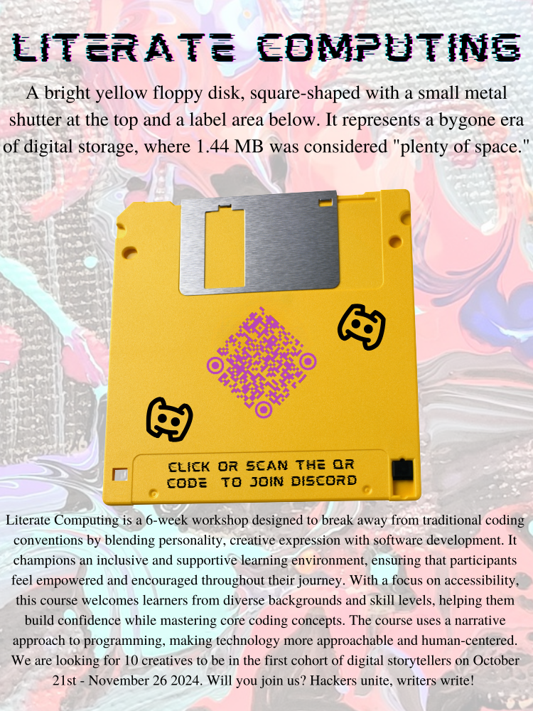

# ANNOUNCEMENT 🔊 gadfly-ai literate computing writer's workshop

<section>
<figure>
<figcaption>
    
A bright yellow floppy disk, square-shaped with a small metal shutter at the top and a label area below. It represents a bygone era of digital storage, where 1.44 MB was considered "plenty of space."
    
</figcaption>

</figure>
<a href="https://discord.gg/uqGjdVDK">Click here or scan the QR code to join our Discord server for an opportunity to participate in the course.</a>
</section>

## about the course

Literate Computing is a 6-week workshop designed to break away from traditional coding conventions by blending personality, creative expression with software development. It champions an inclusive and supportive learning environment, ensuring that participants feel empowered and encouraged throughout their journey. With a focus on accessibility, this course welcomes learners from diverse backgrounds and skill levels, helping them build confidence while mastering core coding concepts. The course uses a narrative approach to programming, making technology more approachable and human-centered. We are looking for 10 creatives to be in the first cohort of digital storytellers on <time>October 21st 2024</time> - <time>November 26 2024</time>. Will you join us? Hackers unite, writers write!

<a href="https://discord.gg/uqGjdVDK">Follow this link to our Discord server if you are interested! We'll see you there.</a>
